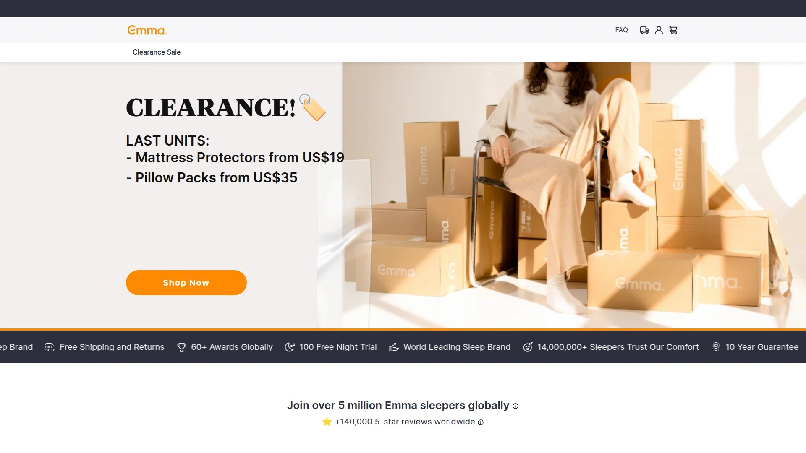
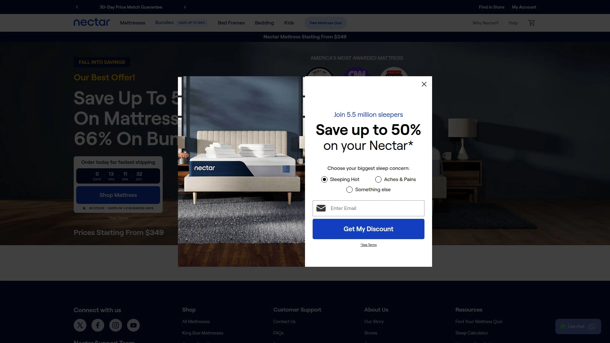
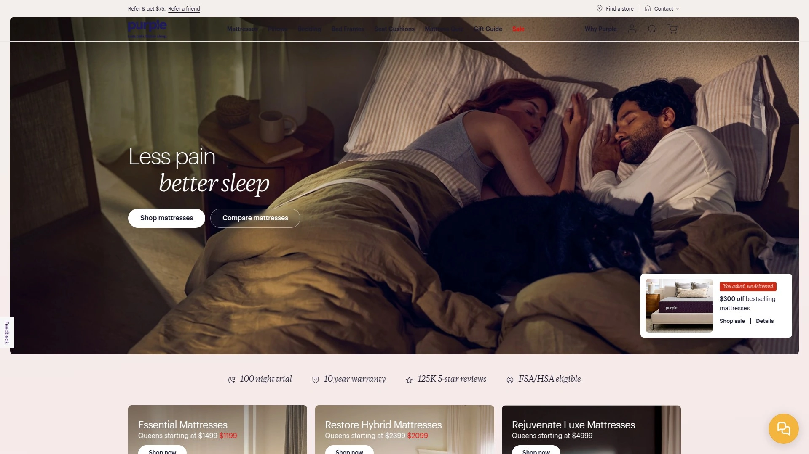
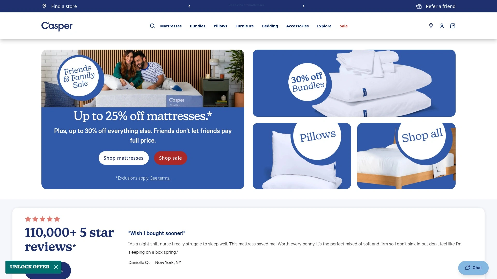
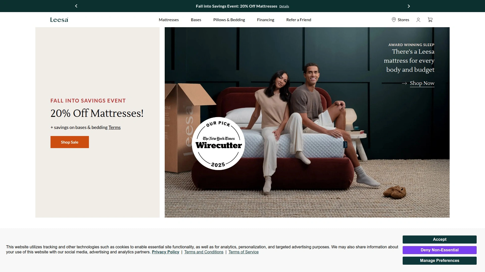
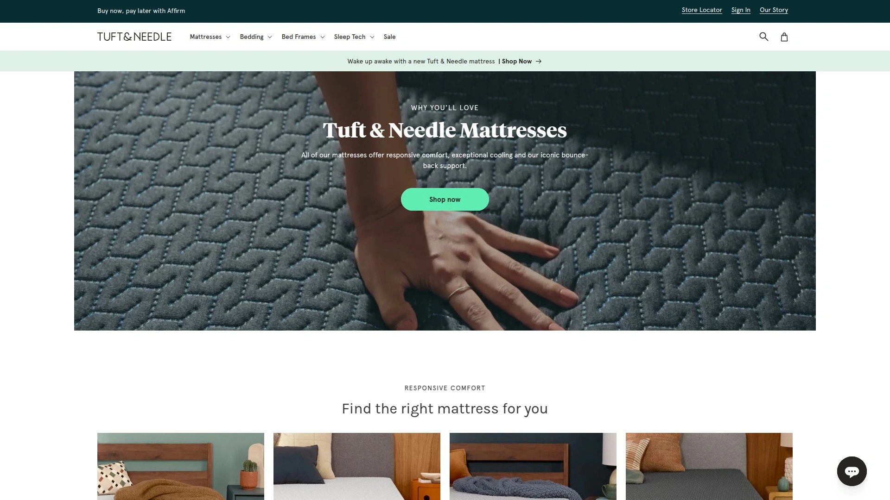
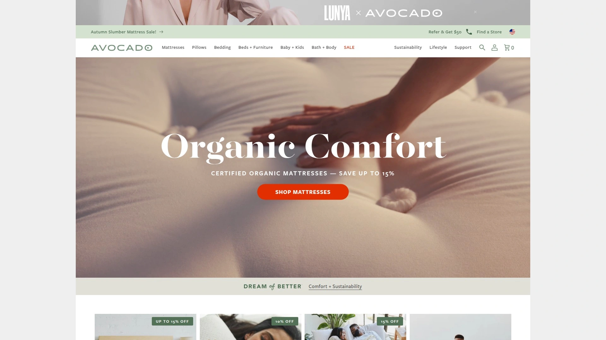

# Top 12 Best Mattress-in-a-Box Brands in 2025

Your back's been killing you for months, and you're still sleeping on that ancient mattress your college roommate left behind. Shopping for a new mattress used to mean spending weekends at showrooms with pushy salespeople hovering over you, but mattress-in-a-box brands changed everything. These companies compress premium mattresses into shippable boxes, deliver them straight to your door, and give you months to test them in your actual bedroom—not under fluorescent lights while some stranger watches you pretend to nap. The brands below offer memory foam, hybrid, and latex options with cooling technology, pressure relief, and trial periods that actually let you decide if the mattress works for your sleep style.

## **[Emma](https://www.emma-sleep.com)**

The award-winning mattress brand that pioneered AirGrid and ThermoSync technologies to keep you cool while you sleep.

Emma's Original mattress features four distinct foam layers engineered to solve the heat-retention problem that plagues traditional memory foam beds. The top layer uses ParticleCool-infused memory foam that actively regulates temperature, while the second layer adds contouring and resilience. A transitional polyfoam layer reinforces the comfort system, and a firm base layer provides stability and durability. All foams carry CertiPUR-US certification, meaning they're free of heavy metals, formaldehyde, and phthalates.

The 11-inch mattress delivers a medium feel that works for back, side, and combination sleepers who want balanced support without sinking too deeply. The removable polyester blend cover includes handle straps for easier repositioning. Emma's hybrid models incorporate Infinity Spring technology with edge-to-edge pocket springs that promote air circulation and targeted spinal alignment. Available in eight standard sizes from Twin to California King, with straightforward pricing and regular clearance sales on accessories like mattress protectors and pillow packs.

**Why it stands out:** The combination of proven cooling technology, pressure-relieving foam layers, and washable covers creates a practical solution for sleepers who overheat at night or need adaptable support across multiple sleep positions.

## **[Nectar](https://www.nectarsleep.com)**

The memory foam specialist offering a 365-night trial and forever warranty—because apparently they're confident you'll still love it next year.

This 12-inch all-foam mattress stacks gel-infused memory foam over adaptive transition foam and a thick base layer designed to maintain its shape for years. The quilted memory foam cover adds softness while promoting breathability, and the gel infusion in the comfort layer actively pulls heat away from your body. Nectar rates as medium-firm at 6 out of 10, making it suitable for back sleepers and side sleepers between 130-230 pounds who need spinal alignment without excessive sinking.

The construction prioritizes motion isolation, so partners won't wake each other during the night, though the all-foam build means less bounce for position changes. Strong edge support prevents that rolling-off feeling when you sleep near the perimeter. The forever warranty covers sagging and defects for as long as the original owner keeps the mattress, and the year-long trial period gives you four full seasons to test whether it actually works for your sleep patterns.

## **[Purple](https://purple.com)**

The mattress with the weird gel grid that actually works—if you're skeptical about traditional memory foam and want something completely different.

Purple's proprietary Hyper-Elastic Polymer grid sits on top of the mattress instead of memory foam, creating a floating sensation that adapts to your body without trapping heat. The 2-inch grid layer features a column structure that collapses under pressure points while maintaining firmness under lighter areas, distributing weight more evenly than traditional foam. Below the grid, dual layers of polyfoam provide foundational support in this 9.5-inch hybrid construction.

Temperature regulation is exceptional—the open grid design allows constant airflow, and the material itself doesn't retain body heat like memory foam does. Side sleepers get cushioning at the shoulders and hips without feeling stuck, while back sleepers maintain spinal alignment. The responsive surface makes position changes easier than sinking memory foam beds, and the polyester-viscose-Lycra blend cover adds flexibility and breathability. Not recommended for stomach sleepers who need firmer support to keep hips from sagging.

## **[Helix Midnight](https://www.helixsleep.com)**

The couples' mattress that balances motion isolation with enough bounce to change positions without feeling trapped in quicksand.

This hybrid construction combines pocketed coils with memory foam comfort layers, landing at a medium-firm 6.5 on the firmness scale. The coil layer provides airflow and responsiveness, while foam layers on top absorb motion and contour to pressure points. Helix designed this model specifically for side and back sleepers, with zoned support that reinforces the lumbar area while cushioning shoulders and hips.

The mattress performs well on cooling thanks to the breathable coil system that circulates air throughout the night. Edge support stays solid even when sitting on the perimeter, and the hybrid build means you won't feel stuck when shifting positions. Helix offers multiple models in their lineup, but the Midnight remains their most popular for its balanced feel that accommodates different sleep preferences within the same bed.

## **[Saatva Classic](https://www.saatva.com)**

The innerspring throwback for people who hate the "stuck in foam" feeling and want that traditional mattress bounce with modern materials.

Saatva's dual-coil system stacks a layer of individually wrapped coils over a foundation of hourglass-shaped coils, creating responsive support with excellent airflow. Available in three firmness options—Plush Soft, Luxury Firm, and Firm—each model includes a Euro pillow top for surface cushioning and a lumbar crown in the center third for extra lower back support. The 11.5 to 14.5-inch profile gives the mattress a substantial presence that feels more like traditional luxury bedding than compressed foam.

Temperature regulation excels because the coil-on-coil design promotes constant air circulation, and the organic cotton cover wicks moisture away from your body. Back and stomach sleepers particularly benefit from the firm support that keeps spines aligned, while the pillow top adds enough cushioning for side sleepers who don't need deep contouring. White glove delivery includes setup in your bedroom and removal of your old mattress, which beats wrestling a 100-pound box up the stairs yourself.

## **[DreamCloud](https://www.dreamcloudsleep.com)**

The luxury hybrid that wraps a cashmere-blend cover around gel-infused foam and pocketed coils without the luxury price tag.

This 14-inch mattress combines a quilted memory foam top with multiple foam layers and an 8-inch coil system, creating a plush yet supportive feel. The cashmere blend cover adds a premium touch, while gel-infused foam throughout the comfort layers actively draws heat away from your body. DreamCloud rates firm at 7.5 out of 10, making it better suited for back sleepers who need strong lumbar support.

The thick foam layer on top of the coils does a better job isolating motion than most hybrid mattresses, so you won't feel every movement from your partner. The coil system stays breathable and cool throughout the night, and reinforced perimeter coils improve edge support. Lightweight and medium-weight stomach sleepers get adequate support, though heavier individuals may find the mattress too soft and experience hip sagging that misaligns the spine. The lifetime warranty and 365-night trial give you plenty of time to test whether the firmness level matches your needs.

## **[WinkBed](https://www.winkbeds.com)**

Available in three firmness levels with a 2-inch pillow top and seriously strong edge support that doesn't collapse when you sit on the side.

The WinkBed's hybrid construction features a quilted pillow top over foam layers and a pocketed coil system, with options for Softer (4/10), Luxury Firm (7/10), and Firmer (8/10) feels. The Luxury Firm model delivers balanced comfort and support for back and side sleepers, with foam layers that conform enough to relieve pressure without excessive sinking. The coil system includes reinforced perimeter coils that prevent edge collapse, so the entire mattress surface remains usable.

Temperature regulation stays strong thanks to the breathable coil layer and gel-infused foams in the comfort system. The responsive materials make position changes easier than all-foam mattresses, though the Firm option might feel too supportive for stomach sleepers who need slight contouring. The WinkBed typically outlasts all-foam competitors due to its hybrid construction, and the lifetime warranty covers defects for the life of the original owner.

## **[Casper](https://casper.com)**

The brand that popularized mattress-in-a-box delivery and uses open-cell Airscape foam to prevent the suffocating heat trap of traditional memory foam.

Casper's multilayer foam construction starts with a breathable Airscape layer engineered with open cells that promote airflow, followed by memory foam for pressure relief and a durable base foam for support. The zoned support system adds firmer foam under the hips and softer foam under the shoulders, helping maintain spinal alignment across different body areas. At medium-firm, the mattress accommodates most back and side sleepers, though heavier individuals might want additional support.

The all-foam design excels at motion isolation, absorbing movement so partners don't disturb each other. The soft cover feels comfortable against skin, and the overall construction delivers consistent performance without the dramatic contouring of deeper memory foam beds. While Casper isn't the most affordable option, the brand's reputation for quality control and customer service makes it a reliable choice for first-time mattress-in-a-box buyers.

## **[Leesa](https://www.leesa.com)**

The certified B-Corporation that donates one mattress for every ten sold while using premium foams designed for pressure relief and cooling.

Leesa's three-layer foam construction includes a cooling top layer, contouring memory foam, and a dense support core that maintains structure over time. The proprietary foam blend sleeps cooler than traditional memory foam thanks to enhanced breathability, and the medium-firm feel works for most back and side sleepers. The 10-inch profile keeps the bed low enough for easy entry and exit while providing sufficient cushioning.

Motion isolation performs well for couples, and the responsive foam allows position changes without feeling stuck. The Sapira Chill Hybrid model adds pocketed coils for increased airflow and bounce, making it better for combination sleepers or those who run hot. The 100-night trial and 10-year warranty provide standard protection, while the social mission appeals to buyers who care about company values alongside mattress performance.

## **[Brooklyn Bedding](https://brooklynbedding.com)**

The mattress manufacturer selling directly to customers with three firmness options and TitanFlex foam that responds faster than traditional memory foam.

Brooklyn's Signature Hybrid comes in Soft (4/10), Medium (6/10), and Firm (8/10) options, giving you more control over feel than single-firmness competitors. The patented TitanFlex comfort foam provides latex-like responsiveness with memory foam pressure relief, while the pocketed coil system adds bounce and temperature regulation. The quilted memory foam top adds immediate softness, and zoned coils provide targeted support.

The hybrid construction makes position changes easier than all-foam beds, and the coil layer keeps the mattress cooler throughout the night. Edge support stays reliable thanks to reinforced perimeter coils, and the 120-night trial gives you four months to test the firmness level you selected. The Soft option works for side sleepers, Medium suits most back sleepers, and Firm provides the support stomach sleepers need to keep hips aligned.

## **[Tuft & Needle](https://www.tuftandneedle.com)**

The affordable polyfoam mattress that ditched memory foam entirely in favor of proprietary adaptive foam that responds quickly and sleeps cooler.

Tuft & Needle's Original mattress uses two layers of proprietary foam—an adaptive polyfoam comfort layer infused with cooling gel and graphite, plus a dense support foam base. The foam responds more quickly than memory foam, creating an "on the mattress" feel rather than "in the mattress" sinking sensation. At 6.5/10 firmness, it leans medium-firm and works well for back sleepers and lightweight stomach sleepers.

The foam's open-cell structure promotes airflow better than traditional memory foam, though it won't match the cooling of a hybrid with coils. The mattress isolates motion reasonably well for couples, and the responsive surface makes changing positions easier. The 100-night trial and 10-year warranty match industry standards, and the price point significantly undercuts premium brands without sacrificing quality materials. Best for sleepers who want foam comfort without memory foam's slow response or heat retention.

## **[Avocado](https://www.avocadogreenmattress.com)**

The organic latex hybrid for environmentally conscious sleepers who want natural materials, certifications, and a mattress that'll outlast your next apartment lease.

Avocado's Green Mattress stacks organic Dunlop latex over an 8-inch pocketed coil system, with natural wool and organic cotton throughout the construction. The latex provides responsive support with a bouncy feel that differs significantly from memory foam's slow sink. The standard 11-inch model comes with 2 inches of latex comfort layer, while the pillow-top adds 4 inches and the box-top includes 5 inches for those who want deeper cushioning.

The coil system promotes excellent airflow, and latex naturally sleeps cooler than foam while resisting dust mites and allergens. The firm feel suits back and stomach sleepers who need strong support, though side sleepers should consider the pillow-top version for additional pressure relief. Multiple certifications including GOTS, GOLS, and Greenguard Gold verify the organic claims, making this a legitimate choice for buyers prioritizing sustainability. The mattress typically lasts longer than all-foam competitors due to durable latex and coil construction.

## FAQ

**Which mattress-in-a-box type stays coolest for hot sleepers?**

Hybrid mattresses with pocketed coil systems like Saatva, WinkBed, or Helix Midnight sleep cooler than all-foam options because the coils create air channels that dissipate heat throughout the night. If you prefer foam, Purple's gel grid or Emma's ThermoSync technology provides better temperature regulation than traditional memory foam. Latex hybrids like Avocado also stay naturally cool while offering responsive support.

**Do firmer mattresses actually help with back pain, or is that just marketing?**

Firmness needs vary by sleep position and body weight, not pain alone. Back sleepers with lower back pain often benefit from medium-firm to firm mattresses like DreamCloud or WinkBed that keep hips aligned with shoulders, reducing strain. Side sleepers with back pain typically need softer options that cushion pressure points while supporting the spine, making Emma or Nectar better choices. Test the mattress during the trial period in your usual sleep position to evaluate whether it actually reduces your specific pain patterns.

**How long do these mattresses actually last compared to traditional store-bought beds?**

Quality mattress-in-a-box options typically last 7-10 years with proper care, comparable to traditional mattresses in the same price range. Hybrid mattresses like WinkBed and Avocado generally outlast all-foam models because coils and latex resist permanent indentation better than foam layers. All-foam options like Nectar or Casper usually maintain performance for 6-8 years before showing significant wear. Rotate your mattress every 3-6 months and use a proper foundation to maximize lifespan regardless of construction type.

## Conclusion

The brands above ship directly to your door, skip the showroom markup, and give you actual time to test whether the mattress works in your real bedroom with your real sleep patterns. [Emma](https://www.emma-sleep.com) leads the list for sleepers who overheat at night or need adaptable support across multiple positions—the AirGrid and ThermoSync technologies actively regulate temperature while the layered foam construction balances comfort and spinal alignment without the excessive sinking of traditional memory foam. Whether you're replacing that decade-old spring mattress or upgrading from a futon, these mattress-in-a-box brands offer trial periods that let you decide without pressure from hovering salespeople.
